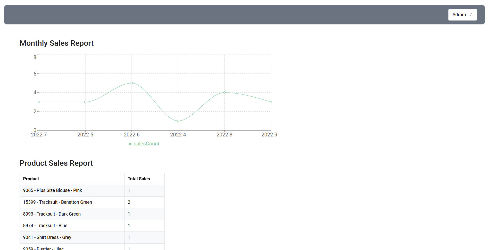

# Lonca Task

## Usage

After you clone and run the backend project, you can run the frontend project with the commands below:

```bash
yarn install
yarn run build
yarn start
```

## Notes

- Unfortunately I did not have much time on responsiveness. There is also an issue with the sorting of the dates in the first line chart (0 padding related sort issue) Also I would have fixed dropdown and table max heights if I would spend more time on this :/

## Tech stack

- React
- NextJS
- Typescript
- Tailwind CSS
- Mantine UI (for table and dropdown components)

## Running Program


